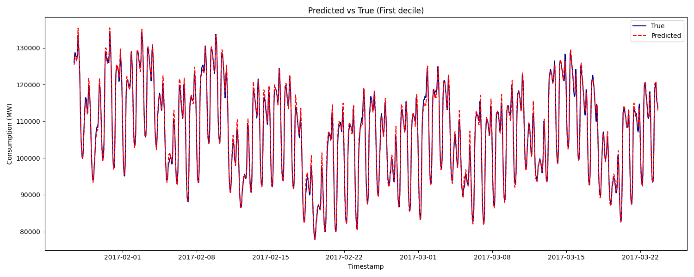
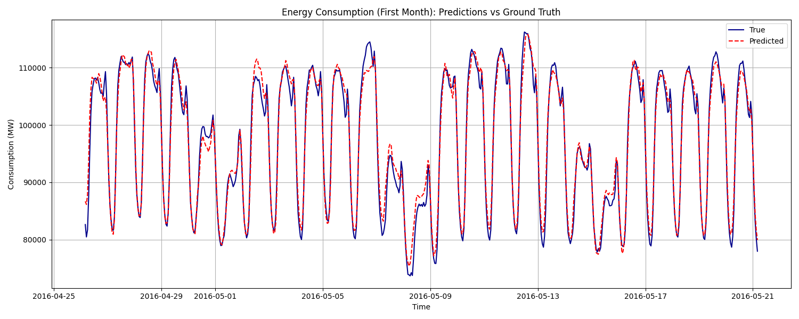
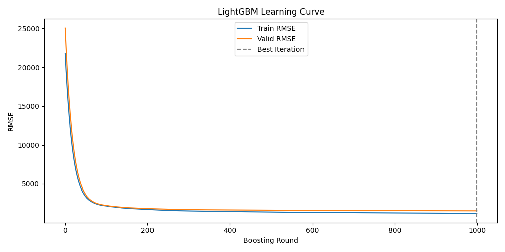
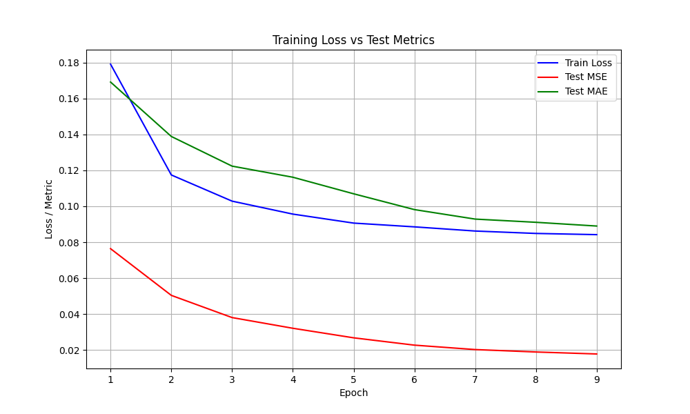
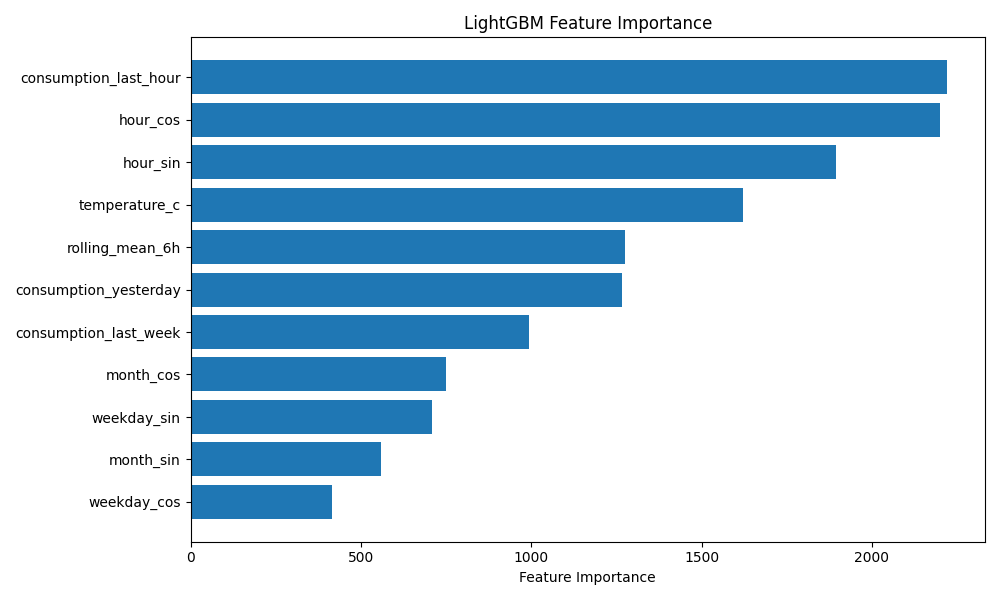

# Energy Forecasting with Transformer and LightGBM

This project focuses on forecasting urban energy consumption based solely on historical usage and temperature data from Chicago (2011–2018). Two model architectures are compared: a LightGBM ensemble model and a Transformer-based neural network (based on the Moments Time Series Transformer). The goal is to predict hourly electricity demand and analyze model performance, interpretability, and generalizability.

The project also simulates a real-time setting, where hourly predictions are made sequentially to mirror operational deployment. The modular design allows for adaptation to other urban contexts, assuming a compatible data structure.

The modular structure is transferable to similar forecasting tasks such as load prediction or material flow analysis in industrial systems.
Full repository available at: https://github.com/dlajic/energy-forecasting-transformer-lightgbm

---

## Overview

* **Goal**: Predict hourly energy consumption using timestamp, temperature, and historical consumption features.
* **Models**: LightGBM and Time Series Transformer Model (moements).
* **Results**: Both models perform well; LightGBM achieves the best overall performance.
* **Dashboard**: Live forecast simulation via Streamlit interface.
* **Usage Context**: Developed as a prototype for real-time hourly forecasting, with a modular structure that supports adaptation to similar operational settings.

<div style="page-break-after: always;"></div>
---

## Results

### Evaluation Metrics

| Model       | RMSE    | R²    | MAPE   |
| ----------- | ------- | ----- | ------ |
| Transformer | 3933.57 | 0.972 | 2.32 % |
| LightGBM    | 1383.68 | 0.996 | 0.84 % |

> **Note:** All values are in megawatts (MW). Hourly consumption typically ranges from 100,000 to 200,000 MW.

* LightGBM achieves the best trade-off between performance and resource efficiency.  
* The Transformer model generalizes well to temporal patterns and may scale better in more complex or multi-network scenarios.  
* Both models show no signs of overfitting, supported by learning curves, consistent evaluation metrics, and additional diagnostics such as residual distribution analysis and noise-feature validation.

---

### Forecast Plots

<table>
  <tr>
    <td>
      
    </td>
    <td>
      
    </td>
  </tr>
</table>


> **Note:** Example forecast windows are shown (LightGBM: 3 months, Transformer: 1 month).  
> LightGBM maintains highly consistent performance over time, while the Transformer shows occasional over- or underestimation on special peak days.

<div style="page-break-after: always;"></div>
---

### Learning Curves

These plots visualize training dynamics and help detect overfitting.

<table>
  <tr>
    <td>
      
    </td>
    <td>
      
    </td>
  </tr>
</table>

* The LightGBM curve shows a stable gap between training and validation RMSE, indicating low overfitting.  
* The Transformer learning curve also converges smoothly without divergence, supporting generalizability.  
* In addition to visual inspection, further checks like residual analysis and a noise feature test confirmed robustness.

> **Note:** The LightGBM curve shows boosting rounds with validation RMSE,  
> while the Transformer plot tracks training loss and test metrics per epoch.

More plots are available in the respective `/results` directories.

---

## Streamlit Simulation Dashboard

* Live hourly forecast simulation
* Uses the trained models
* Repeats predictions sequentially for each hour to simulate real-time data flow
* Hosted on Hugging Face (CPU only, slower prediction speed)

You can try the model predictions interactively in the Streamlit dashboard:

**Try it here:**
**[Launch Streamlit App](https://huggingface.co/spaces/dlaj/energy-forecasting-demo)**

<div style="page-break-after: always;"></div>
---

## Data

* **Source**:

  * [COMED Hourly Consumption Data](https://www.kaggle.com/datasets/robikscube/hourly-energy-consumption)
  * [NOAA Temperature Data](https://www.ncei.noaa.gov/)
* **Time range**: January 2011 – August 2018
* **Merged file**: `data/processed/energy_consumption_aggregated_cleaned.csv`

---

## Feature Engineering

The models rely on timestamp and temperature data, enriched with derived time-based and lag-based features:

* hour\_sin, hour\_cos
* weekday\_sin, weekday\_cos
* month\_sin, month\_cos
* rolling\_mean\_6h
* temperature\_c
* consumption\_last\_hour
* consumption\_yesterday
* consumption\_last\_week

Feature selection was guided by LightGBM feature importance analysis. Weak features with nearly no impact like "is_weekend" were deleted.

### Final LightGBM Feature Importance
 


<div style="page-break-after: always;"></div>
---

## Model Development

### LightGBM

* Custom grid search with over 50 parameter combinations
* Parameters tested:

  * num\_leaves, max\_depth, learning\_rate, lambda\_l1, lambda\_l2, min\_split\_gain
* Final Parameters:

  * learning\_rate: 0.05
  * num\_leaves: 15
  * max\_depth: 5
  * lambda\_l1: 1.0
  * lambda\_l2: 0.0
  * min\_split\_gain: 0.0
  * n\_estimators: 1000
  * objective: regression

Overfitting was monitored using a noise feature and RMSE gaps. See grid search results:
`notebooks/lightgbm/lightgbm_gridsearch_results.csv`

### Transformer (Moments Time Series Transformer)

* Based on pretrained Moments model
* Fine-tuned only the forecasting head for regular training
* Also tested variants with unfrozen encoder layers and dropout
* Final config:

  * task\_name: forecasting
  * forecast\_horizon: 24
  * head\_dropout: 0.1
  * weight\_decay: 0
  * freeze\_encoder: True
  * freeze\_embedder: True
  * freeze\_head: False


<div style="page-break-after: always;"></div>
---

## Project Structure

```
energy-forecasting-transformer-lightgbm/
├── data/                   # Raw, external, processed datasets
├── notebooks/              # EDA, lightgbm and transformer prototypes, including hyperparameter tuning and model selection
├── scripts/                # Data preprocessing scripts
├── lightgbm_model/         # LightGBM model, scripts, results
├── transformer_model/      # Transformer model, scripts, results
├── streamlit_simulation/   # Streamlit dashboard
├── requirements.txt        # Main environment
├── requirements_lgbm.txt   # Optional for LightGBM
├── setup.py
└── README.md
```

---

## Reproducibility

You can reuse this pipeline with any dataset, as long as it contains the following key columns:

```csv
timestamp,       # hourly timestamp (e.g., "2018-01-01 14:00")
consumption,     # energy usage (aggregated; for individual users, consider adding an ID column)
temperature      # hourly
```

### Notes:

* Transformer model training is **very slow on CPU**, also with AMD GPU
* Recommended: use **CUDA or Google Colab + CUDA GPU runtime** for transformer training
* All scripts are modular and can be executed separately

---

## Run Locally

### Prerequisites

* Python 3.9–3.11 (required for Moments Transformer)

### Installation

```bash
git clone https://github.com/dlajic/energy-forecasting-transformer-lightgbm.git
cd energy-forecasting-transformer-lightgbm
pip install -r requirements.txt
```
<div style="page-break-after: always;"></div>

### Preprocess Data

```bash
python -m scripts.data_preprocessing.merge_temperature_data  # merges raw temperature and energy data (only needed with raw inputs)
python -m scripts.data_preprocessing.preprocess_data         # launches full preprocessing pipeline; use if data already matches expected format
```

### Train Models

```bash
python -m lightgbm_model.scripts.train.train_lightgbm
python -m transformer_model.scripts.training.train
```

### Evaluate Models

```bash
python -m lightgbm_model.scripts.eval.eval_lightgbm
python -m transformer_model.scripts.evaluation.evaluate
python -m transformer_model.scripts.evaluation.plot_learning_curves
```

### Run Streamlit Dashboard (local)

```bash
streamlit run streamlit_simulation/app.py
```

For editable install:

```bash
pip install -e .
```

---

## Author

Dean Lajic
GitHub: [dlajic](https://github.com/dlajic)

---

## References

- Moments Time Series Transformer  
  https://github.com/moment-timeseries-foundation-model/moment
- COMED Consumption Dataset  
  https://www.kaggle.com/datasets/robikscube/hourly-energy-consumption
- NOAA Weather Data  
  https://www.ncei.noaa.gov