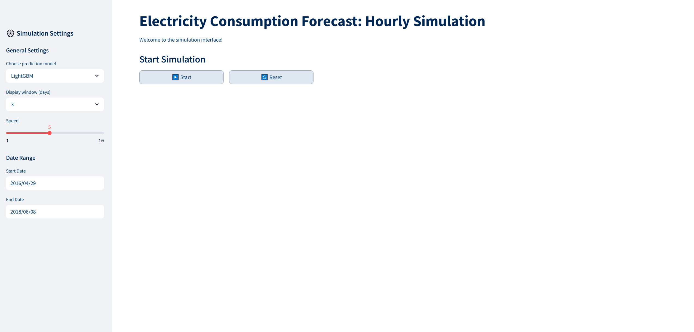

# Energy Forecasting with Transformer and LightGBM

This project focuses on forecasting urban energy consumption based solely on historical usage and temperature data from Chicago (2011–2018). Two model architectures are compared: a LightGBM ensemble model and a Transformer-based neural network (based on the Moments Time Series Transformer). The goal is to predict hourly electricity demand and analyze model performance, interpretability, and generalizability.

---

## Overview

- **Goal**: Predict hourly energy consumption using timestamp and temperature data.
- **Models**: LightGBM (scikit-learn interface) and Transformer (PyTorch).
- **Results**: Both models perform well; LightGBM achieves the best overall performance.
- **Demo**: A Streamlit dashboard allows interactive forecasting.
- **Use Case**: This project showcases practical, scalable modeling and serves as a technical sample for data science positions.

---

## Results

| Model       | RMSE     | R²      | MAPE     |
|-------------|----------|---------|----------|
| Transformer | 3933.57  | 0.972   | 2.32 %   |
| LightGBM    | 1383.68  | 0.996   | 0.84 %   |

*Note: All values are in megawatts (MW). Hourly consumption typically ranges from 100,000 to 200,000 MW.*

- LightGBM achieves the lowest error and is computationally efficient.
- Transformer generalizes well, especially for sequence-based patterns.
- Both models show no signs of overfitting (see learning curves below).

---

## Visualizations

| Final LightGBM Feature Importance | Transformer Learning Curve |
|:--:|:--:|
|  |  |

Additional plots and tuning results are available in the `notebooks/` directory.

---

## Data

- **Source**:  
  - [COMED Hourly Consumption Data](https://www.kaggle.com/datasets/robikscube/hourly-energy-consumption)  
  - [NOAA Temperature Data](https://www.ncei.noaa.gov/) – downloaded via the historical weather request form (email delivery)
- **Time range**: January 2011 – August 2018
- **Merged data file**: `data/processed/energy_consumption_aggregated_cleaned.csv`

---

## Feature Engineering

The models rely solely on timestamp and temperature, enriched via the following features:

```
"hour_sin", "hour_cos", "weekday_sin", "weekday_cos",
"month_sin", "month_cos", "temperature_c",
"rolling_mean_6h", "consumption_last_hour",
"consumption_yesterday", "consumption_last_week"
```

- Cyclical encodings help capture daily, weekly, and seasonal patterns.
- Lag features support temporal dependencies.
- Feature importance (see plot) guided final selection.

---

## Model Development

### LightGBM

- Over 50 hyperparameter combinations tested using `GridSearchCV`.
- Overfitting checked via `Train vs. Validation RMSE Gap` and a noise feature ("noise_feature").
- Final parameters:

```python
{
    'learning_rate': 0.05,
    'num_leaves': 15,
    'max_depth': 5,
    'lambda_l1': 1.0,
    'lambda_l2': 0.0,
    'min_split_gain': 0.0,
    'n_estimators': 1000,
    'objective': 'regression'
}
```

- Grid search results and evaluation metrics available under  
  `notebooks/lightgbm/lightgbm_gridsearch_results.csv`

### Transformer (Moments Time Series Transformer)

- Based on pretrained model; fine-tuned on forecast head only.
- Also tested: full model training with unfreezed encoder + dropout + weight decay
- Found that minimal gains (e.g. 0.14% MAPE) came at the cost of higher overfitting risk → base model used.
- Implementation: PyTorch Lightning-based modular training scripts.

---

## Project Structure

```
energy-forecasting-transformer-lightgbm/
|
├── data/
│   ├── raw/                # Original data
│   ├── external/           # Temperature data
│   └── processed/          # Cleaned & merged datasets
│
├── notebooks/              # EDA and model prototyping
│   ├── eda/
│   ├── lightgbm/
│   └── transformer/
│
├── scripts/                # Data preprocessing
│   └── data_preprocessing/
│
├── lightgbm_model/
│   ├── scripts/            # Training + evaluation
│   ├── model/              # Final model
│   ├── results/            # Metrics, plots
│
├── transformer_model/
│   ├── scripts/            # Modular PyTorch training
│   ├── results/
│
├── streamlit_simulation/   # Streamlit dashboard app
│   └── app.py
│
├── requirements.txt
├── requirements_lgbm.txt
├── setup.py
└── README.md
```

---

## Reproducibility

This pipeline can be used with any dataset that contains:

```csv
timestamp, consumption, temperature
```

After adjusting input data, the training and evaluation steps can be rerun using the modular scripts (see below).

---

## Run Locally

### Prerequisites

- Python 3.9–3.11 (required for `moments` transformer)
- Recommended: virtualenv or conda environment

### 1. Clone the repository

```bash
git clone https://github.com/dlajic/energy-forecasting-transformer-lightgbm.git
cd energy-forecasting-transformer-lightgbm
```

### 2. Install requirements

```bash
pip install -r requirements.txt
```

### 3. Preprocess data

```bash
python -m scripts.data_preprocessing.merge_temperature_data
python -m scripts.data_preprocessing.preprocess_data
```

### 4. Train models

```bash
python -m lightgbm_model.scripts.train.train_lightgbm
python -m transformer_model.scripts.training.train
```

### 5. Evaluate models

```bash
python -m lightgbm_model.scripts.eval.eval_lightgbm
python -m transformer_model.scripts.evaluation.evaluate
python -m transformer_model.scripts.evaluation.plot_learning_curves
```

### 6. Launch dashboard (optional)

```bash
streamlit run streamlit_simulation/app.py
```

For development mode (editable install), run:

```bash
pip install -e .
```

---

## Live Demo

Interactively test the model here:  
https://huggingface.co/spaces/dlaj/energy-forecasting-demo

You can try the model predictions interactively in the Streamlit dashboard:

**🔗 [Launch Streamlit App](https://huggingface.co/spaces/dlaj/energy-forecasting-demo)**

(Optional) Preview:



---

## Author

Dean Lajic  
GitHub: [dlajic](https://github.com/dlajic)

---

## References

- Moments Time Series Transformer  
  https://github.com/autogluon/moment
- COMED Consumption Dataset  
  https://www.kaggle.com/datasets/robikscube/hourly-energy-consumption
- NOAA Weather Data  
  https://www.ncei.noaa.gov
